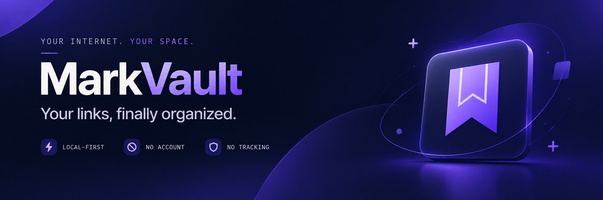

<div align="center">



# MarkVault

### A private, local-first home for your bookmarks


<br>

**No account. No application server. No tracking by default.**

[Report an issue](https://github.com/TajkirHossen-14/MarkVault/issues) • [বাংলা setup guide](USER-GUIDE-BN.md)

</div>

---

MarkVault is a browser-based bookmark manager for the article you want to read later, the tool you will need again, and the idea you do not want to lose. Save links, organize them with folders and tags, and rediscover them through fast search and keyboard shortcuts. Your collection stays in your browser—not in an account on someone else’s server.

Built with **HTML, modern CSS, native JavaScript modules, Web Components and IndexedDB**. No runtime framework or external JavaScript library. A new vault is genuinely empty: no demo bookmarks, fake activity, or sign-up flow.

## 📌 Table of Contents

- [💡 Why MarkVault](#why-markvault)
- [✨ Features](#features)
- [🎨 Design and Responsive Experience](#design-and-responsive-experience)
- [🛠️ Tech Stack](#tech-stack)
- [📁 Project Structure](#project-structure)
- [🚀 Getting Started](#getting-started)
- [💾 Download and Back Up](#download-and-back-up)
- [⌨️ Keyboard Shortcuts](#keyboard-shortcuts)
- [🗺️ Pages and Routes](#pages-and-routes)
- [🔒 Privacy and Data Storage](#privacy-and-data-storage)
- [🏗️ Architecture](#architecture)
- [✅ Testing and Verification](#testing-and-verification)
- [🚀 Deploying](#deploying)
- [📋 Roadmap and Known Limitations](#roadmap-and-known-limitations)
- [🤝🏼 Contributing](#contributing)
- [📜 License](#license)

---

## 💡 Why MarkVault

Bookmarks should be easier to find than the tabs they replaced. MarkVault combines a considered interface with a simple ownership model: your links live locally, export to open formats, and do not require an account.

- **A quiet collection** — Folders for structure, tags for connections, notes for context.
- **Your browser, your data** — No app-owned API, remote database or recovery account.
- **A fast way back** — Search, favorites, reading state, smart views and keyboard controls.
- **An open door** — Import your existing collection and export whenever you want.

> Local-first also means **back up your data**. Clearing site data or deleting your browser profile can remove your vault. Keep regular JSON exports somewhere safe.

---

## ✨ Features

### 💾 Save and Organize

- Add/edit bookmarks with title, description, Markdown note, folder and comma-separated tags.
- Normalize URLs and prevent duplicate links, including tracking-parameter variants.
- Nest folders up to three levels; deleting a folder preserves its bookmarks in All.
- Favorite links, mark them read, and track visits opened through MarkVault.
- Smart views: **All bookmarks, Unread, Favorites, Recent, Unreachable and Trash**.
- Restore deleted links; Trash records older than 30 days are purged on app boot.

### 🔍 Find and Rediscover

- Fuzzy matching across titles, domains, URLs, notes and tags.
- Grid, list and compact views with sort and favorite filtering.
- Fixed-height windowed rendering, bounded DOM size and retained keyed focus.
- Multi-select and bulk favorite/read/share/delete actions.
- Command palette and a shared keyboard-shortcut reference.
- Local insights: counts, activity grid, top domains and tag usage, aggregated in a worker.

### 📤 Import, Export and Share

- Import browser bookmark HTML, MarkVault JSON, and Raindrop/Pocket-style CSV.
- Review a preview before explicitly confirming the import.
- Skip invalid/duplicate URLs and commit large imports in chunks of 500.
- Export **JSON** for full bookmark data, **HTML** for browsers, or **CSV** for spreadsheets.
- Share selected URLs, titles and descriptions inside a compressed read-only link—no upload.
- Notes and visit history are not included in shared links. Share links are not encrypted.

### 🌐 Browser-Native Essentials

- Same-origin tab updates through BroadcastChannel, with a storage-event fallback.
- Backup reminders, browser storage estimates and persistent-storage requests.
- Optional external favicons and link previews, both **off by default**.
- Manual abortable link checks, honestly labelled network-level “unreachable” results.
- Versioned offline shell caching and a service-worker update prompt.
- Native modal focus trapping, Escape/close behavior, inert backgrounds and reduced-motion support.

---

## 🎨 Design and Responsive Experience

The interface uses a **#5736d9-inspired violet accent**, soft graphite/slate dark surfaces and subtly violet-tinted light surfaces. Geist and JetBrains Mono are self-hosted, including Latin and Latin-ext subsets.

| Desktop | Phone |
|---|---|
| Full sidebar or icon-only rail | Icon-labelled hamburger sheet and bottom tabs |
| Visible control to expand the collapsed rail | Theme control only inside the hamburger/menu |
| CTA → theme → GitHub in the landing nav | A focused header without desktop action clutter |
| Multi-column bookmark and onboarding layouts | Stacked cards, large inputs and touch controls |
| Compact toolbars and hover/focus actions | Persistent touch-accessible actions and full-width sheets |

Theme icons represent the **current** appearance: moon for dark, sun for light. Primary buttons have restrained highlights and hover feedback. Menu/sidebar motion respects reduced-motion settings; scrolling stays native. The footer has neither a technology-stack sentence nor a theme control, and its source attribution is text-only.

The onboarding illustration reserves its full height, so it cannot collapse into the welcome heading. Hamburger section navigation runs after the sheet closes, and focus restoration does not scroll the page back.

---

## 🛠️ Tech Stack

| Layer | Technology |
|---|---|
| Structure | Semantic HTML5 |
| Styling | CSS layers, custom properties, container/media queries |
| Runtime | Vanilla JavaScript, native ES modules |
| Components | Custom elements plus semantic native controls |
| Storage | IndexedDB and versioned localStorage preferences |
| Background work | Module workers for CSV/JSON import and statistics |
| Icons and fonts | Hand-built SVG icons; self-hosted Geist and JetBrains Mono |
| Offline shell | Service Worker and Cache Storage |
| Optional tooling | esbuild static dev server and per-module minification |

**No runtime dependencies.** esbuild is a development dependency, not a library loaded by the website. The badges above are GitHub README assets, not application requests.

---

## 📁 Project Structure

```text
MarkVault/
├── index.html                 # Landing and hash-routed application
├── assets/
│   ├── fonts/                 # Variable fonts and their licenses
│   ├── icons/                 # Brand and PWA SVGs
│   └── readme/banner.svg       # GitHub README banner
├── css/
│   ├── tokens.css             # Theme, color and typography tokens
│   ├── base.css
│   ├── components.css
│   ├── marketing.css
│   ├── app.css
│   └── refinements.css        # Final responsive/control refinements
├── js/
│   ├── core/                  # Store, signals, router, DOM, IDB, windowing
│   ├── data/                  # Schema, migrations and repositories
│   ├── services/              # Business rules and portable formats
│   ├── components/            # SVG, primitives, dialogs and menu
│   ├── pages/                 # Landing, vault, settings, stats and docs
│   ├── workers/               # Import parsing and aggregation
│   ├── lib/constants.js       # Shared shortcut/view definitions
│   ├── theme.js
│   └── main.js
├── dev/                       # Browser tests and source ZIP exporter
├── scripts/build.mjs          # Optional esbuild output to dist/
├── sw.js
├── manifest.webmanifest
├── source-manifest.json       # Download/build inventory
├── package.json
├── jsconfig.json
├── USER-GUIDE-BN.md            # Detailed Bengali setup/migration guide
├── LICENSE
└── README.md
```

**One production HTML entry: `index.html`.** Landing, library, settings, shared links and documentation use hash routes. Themes and optional menu/rail states use query parameters. Only browser tests and source-download utilities retain separate HTML files in `dev/`.

---

## 🚀 Getting Started

### 🧬 Clone or download

```sh
git clone https://github.com/TajkirHossen-14/MarkVault.git
cd MarkVault
```

If using the editor’s downloaded ZIP, extract it and open its `MarkVault` folder instead. The website links to the supplied GitHub repository; editor changes have **not** been pushed directly to that external repo. Merge downloaded files through a branch/PR, preserving the clone’s `.git` directory.

### 🛠️ Recommended: Development server

With Node.js 20+:

```sh
npm install
npm run dev
```

Open **http://127.0.0.1:5173**. The direct workspace is **http://127.0.0.1:5173/index.html#/app**.

### 🌍 Without project tooling

Use your IDE’s static server, such as VS Code Live Server. No application build is required for the unbundled source.

> ⚠️ Do **not** double-click `index.html` and run it through `file://`. Native modules, workers, fetch and service workers require an HTTP(S) origin. Keep the same hostname and port while developing: each origin has separate browser storage.

### 📦 Optional minified build

```sh
npm run build
```

Output goes to `dist/`, retaining native import and worker paths. This command does not typecheck the app. Local npm/build execution must still be verified in your IDE.

---

## 💾 Download and Back Up

Open **`dev/download.html`** or Documentation → **Download source** to create `MarkVault-source.zip` entirely in the browser. It includes source, local fonts, a generated `.gitignore`, tests and the two useful handoff guides.

| What you want to save | Use |
|---|---|
| Application code | Download complete source ZIP |
| Your actual bookmarks, notes and folders | App → Settings → Import & export → JSON |
| Bookmarks for another browser | HTML export |
| A spreadsheet-friendly collection | CSV export |
| Setup/GitHub migration help in Bengali | [USER-GUIDE-BN.md](USER-GUIDE-BN.md) |


⚠️ **Code ZIPs contain no personal bookmarks.** JSON import merges rather than overwriting existing duplicate URLs. To recover all exported bookmark data unchanged, import into an empty vault. Record IDs are remapped; preferences and cached metadata are not restored automatically.

---

## ⌨️ Keyboard Shortcuts

| Shortcut | Action |
|---|---|
| `⌘ / Ctrl + K` | Open command palette |
| `/` | Search your vault |
| `N` | Add a bookmark |
| `J / K` | Navigate bookmarks |
| `Enter` | Open the focused bookmark |
| `F` | Toggle favorite |
| `E` | Edit bookmark |
| `Delete` | Move to Trash |
| `G`, then `A / U / F / T` | All / Unread / Favorites / Trash |
| `?` | Show shortcut reference |
| `Escape` | Close a modal or menu |

App shortcuts pause while typing into a field. The application and marketing reference share `js/lib/constants.js`.

---

## 🗺️ Pages and Routes

| URI | Purpose |
|---|---|
| `index.html#/` | Landing page |
| `index.html#/app` | All bookmarks |
| `#/app?add=1` / `#/app?import=1` | Open add/import dialog |
| `#/app/unread`, `#/app/favorites`, `#/app/recent` | Reading/favorite/recent views |
| `#/app/unreachable`, `#/app/trash` | Network-failure view and Trash |
| `#/app?folder=ID` / `#/app?tag=ID` | Folder/tag collection |
| `#/app/settings?tab=appearance` | Settings; tabs: appearance, previews, transfer, backup, danger |
| `#/app/stats` | Local insights |
| `#/shared?d=BASE64URL` | Read-only shared collection |
| `#/docs?topic=backups` | Documentation |
| `#/dev/kitchen-sink` | Implemented UI primitives |
| `dev/harness.html` | Isolated automated browser tests |
| `dev/download.html` | Source ZIP and guides |
| `index.html?theme=light#/` / `index.html?theme=light#/app` | Light landing/library |
| `index.html?sidebar=collapsed#/app` | Icon-only library rail |
| `index.html?menu=open#/` | Open landing hamburger menu |
| `index.html?section=footer#/` | Landing footer review |

Query parameters before the hash: `?theme=light|dark` overrides initial appearance; `?sidebar=collapsed` opens the icon rail; `?menu=open` opens landing navigation; `?section=footer` requests footer scrolling. The `mvtest-*` database override is for explicit test URLs only.

---

## 🔒 Privacy and Data Storage

### 🗄️ Where data lives

| Store | Main fields |
|---|---|
| `bookmarks` | id, url, normalizedUrl, title, description, note, domain, folderId, tagIds, isFavorite, isRead, visitCount, status, timestamps, deletedAt; reserved faviconUrl/imageUrl |
| `folders` | id, name, parentId, color, icon, order |
| `tags` | id, name, slug, color |
| `meta` | key/value entries, backup time and cached previews |
| localStorage | Versioned preferences under `mv:prefs:v1` |

The IndexedDB database is named **`markvault`**. No server database or project Table API is used. Data belongs to the browser profile and origin: protocol + hostname + port. There is no cross-device sync, recovery login or encryption at rest.

### 🌍 What can leave the browser

- **By default:** application files/fonts come from this site; bookmark data is not uploaded.
- **Optional favicons:** displayed domains go to `https://www.google.com/s2/favicons?domain=…&sz=64`.
- **Optional previews:** full URLs go to `https://api.microlink.io/?url=…` or a user-selected CORS-enabled, authorization-free endpoint.
- **Manual checks / opening links:** requests go to the saved website. Opaque `no-cors` responses cannot reveal HTTP status; results are “unreachable,” not guaranteed broken.
- **Share links:** anyone with the link can decode the included URLs, titles and descriptions. Never share confidential URLs.

The CSP blocks external scripts. Some editor hosting injects a Cloudflare analytics beacon; it remains blocked rather than whitelisted, and the source ZIP strips that known injected beacon from HTML. Disable host analytics for your own privacy-first deployment.

---

## 🏗️ Architecture

```text
Page / component
      ↓
Service — validation, deduplication, business rules
      ↓
Repository — transactional persistence
      ↓
IndexedDB — browser-local stores
```

- **Safe DOM:** cached template fragments, text/attribute escaping and keyed node reconciliation.
- **Reactive state:** proxy store with frame-batched selector subscriptions; lazy signals/computed effects for derived views.
- **Lifecycle:** abort-owned listeners, modal focus restoration without scroll jumps, async route guards and synchronous View Transition snapshots.
- **Transactions:** multi-store saves are atomic. Never await network/timers/prompts inside a live IDB transaction.
- **Imports:** worker CSV/JSON parser; main-thread DOMParser for browser HTML. Parent-first folder mapping, cycle rejection and 500-record chunks. Earlier successful chunks survive a later error; retry skips duplicates.
- **Windowing:** fixed-size grid/rows, responsive column measurement, six-row overscan and bounded keyed cache—not arbitrary-height virtualization.
- **Tab consistency:** BroadcastChannel invalidation with storage-event fallback, not cloud synchronization.
- **Offline:** versioned shell precache, local font/icon refresh and network-only external requests. A first successful online visit is required.

Detailed maintenance guidance is consolidated in [IDE-AI-HANDOFF.md](IDE-AI-HANDOFF.md); separate architecture and test-report Markdown files are intentionally omitted.

---

## ✅ Testing and Verification

### 📝 Recorded result

**58 tests passed, 0 failed** in the final browser harness after consolidating production into `index.html`. This includes the onboarding/menu-navigation fixes, single-entry/PWA routing and the complete source downloader. [View the captured result](https://www.genspark.ai/api/files/s/BawLvi5t).

Coverage includes safe rendering, URL validation, signals/store, IndexedDB/duplicate rollback, folders/tags, imports/exports, sharing, Trash/restore, persistence after reload, real add/edit/search/settings/stats flows, sidebar collapse/reopen, hamburger section and smart-view navigation, source ZIP generation/CRC, and shipping-module/precache inventory.

A 5,000-row test confirmed bounded rendered DOM and access to the last row; it is **not** a measured device framerate benchmark. Tests use a temporary `mvtest-*` database, then remove it. The empty iframe after completion is intentional cleanup.

### ▶️ Run the tests

```text
http://127.0.0.1:5173/dev/harness.html
```

Actual desktop 1280×800 and phone 390×844 captures checked the landing/workspace, icon rail, open menu and both themes. The artwork/heading separation was visually confirmed on desktop and phone. The final phone header was also visually checked with its theme toggle hidden outside the hamburger. Some long-page/footer captures were limited by the screenshot service, so no full-page certification is implied.

### 🚫 Explicitly not certified here

Local npm/build execution; clean checkJs/typecheck; Lighthouse score; complete contrast/screen-reader audit; Firefox/Safari and physical iOS/Android matrix; every viewport/DPR/200% zoom; native OS file-picker dialogs; airplane-mode reload and real deployment upgrade behavior. Precache coverage was checked, not offline transport simulated.

The earlier console run after the router fix had no app page errors; the final 58-test run was verified through its rendered results when repeated console captures became unavailable. Hosting-injected CSP warnings remain expected. No production deployment or external repository push is claimed.

---

## 🚀 Deploying

MarkVault is static and uses relative asset paths and hash routing.

| Host | Configuration |
|---|---|
| GitHub Pages | Settings → Pages → Deploy from branch → `main` → `/ (root)` |
| Netlify | No build command, publish `.`; optional `npm run build` and publish `dist` |
| Vercel | Framework preset **Other**; deploy static project with no application backend |
| This editor | Use the **Publish tab** |

⚠️ Expected Pages address **if enabled by the owner**: `https://tajkirhossen-14.github.io/MarkVault/`. This URL has not been verified live. Source: [TajkirHossen-14/MarkVault](https://github.com/TajkirHossen-14/MarkVault).

⚠️ Do not deploy `node_modules`. Update the service-worker version/inventory for releases. Test module MIME types, subdirectory paths and offline activation on your actual host. SVG-only PWA icons are not universally install-compatible. Editing source does not update a live deployment until publishing.

---

## 📋 Roadmap and Known Limitations

The core local-first application is implemented. The original aspirational brief is not fulfilled one-for-one, and the following remain follow-up work:

- A complete typed custom-element/props catalog; native semantic controls currently handle several surfaces.
- Arbitrary-height measured virtualization, idle-built search index and highlighted match ranges.
- Advanced tree drag/drop, pointer cancellation, reparenting and edge auto-scroll; current ordering is basic.
- More accessible granular activity-heatmap tooltips and SVG-based rendering.
- OG image previews, additional motion helpers and some exact original module splits.
- Full type, accessibility, browser/device, performance and deployment audits.

⚠️ **Recommended order:** run local build and tests → verify real browsers/mobile → audit accessibility/types → profile large vaults → extend features. Cloud sync/accounts are intentionally absent; adding them would require an explicit new architecture/privacy decision.

---

## 🤝🏼 Contributing

Issues and focused improvements are welcome at [the repository](https://github.com/TajkirHossen-14/MarkVault).

1. Fork or clone the repository and create a feature branch.
2. Read this README and [IDE-AI-HANDOFF.md](IDE-AI-HANDOFF.md).
3. Reproduce the issue and add a targeted regression test.
4. Preserve user data, the local-first boundary and the existing design.
5. Check desktop/phone and both themes; update the source manifest and SW inventory if needed.
6. Commit, push your branch and open a Pull Request. Do not force-push shared history.

```sh
git checkout -b fix/focused-improvement
# Make and test the change
git add .
git commit -m "Fix focused issue with regression coverage"
git push -u origin fix/focused-improvement
```

---

## 📜 License

Licensed under the [MIT License](LICENSE). Geist and JetBrains Mono have their respective SIL Open Font Licenses included in `assets/fonts/`.

<div align="center">

**MarkVault — your links, finally organized.**

Built to stay useful. Designed to stay yours.

</div>
